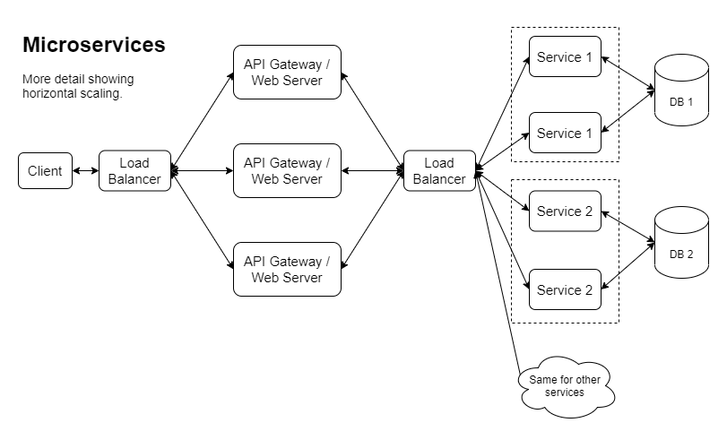

# Project Omega

The last enterprise web architecture pattern you'll ever need. Until the next one.

## TL;DR

The goal is to optimize the developer experience by being able to:

- Develop locally as if it's a monolith
- Deploy as separate microservices
- Simulate the production environment locally using docker

## Demo

Project Omega Proof of Concept - Microservices Monolith Hybrid

Project Omega Demo - Kubernetes Microserves and Standalone Container Deployment

## Why

I want to prove that we don't have to sacrifice developer efficiency to get scalability. More discussion on pros and cons of microservices and monoliths here: [Microservices and Monoliths](./docs/MicroservicesAndMonoliths.md).

My impression is that many industry experts would have us believe that these are our main 3 options:

- Monolith
- Microservices
- "Hybrid" (monolith with some microservices)

I want to show that we don't have to pick any of these options. With a little creativity we can have a true "hybrid" that is both a monolith and a set of microservices. With my current strategy I don't think we can eliminate all the downsides of monolith and microservices, but we can get rid of many of the pain points of both.

## What It Is Not

- I'm not trying to create a framework (not yet at least...). I'm just putting together all the legos I have into a different configuration as an experiment.
- This is not meant to be a community project. I won't be taking pull requests. It's my own personal experiment that I intend to make frequent dramatic breaking changes to without notice. If this concept seems interesting to you and you have suggestions, feel free to fork the repo and try out your ideas yourself.

## Project Goals

- Create a pattern that will work for projects as small single developer hobby projects and also scale to dozens or even hundreds of developers working on large and complex enterprise web applications.
- Be able to develop locally as if it's a monolith:
  - One repository. For all the same reasons companies choose a monorepo approach.
  - Maximum 3 processes to run (client ui, server, docker dependencies with database, message queue, etc). We don't want pages of setup docs to get up and running.
- Be able to deploy as microservices.
- Be able to simulate a production environment with microservices running in docker containers.
- Extremely fast setup time. All dependencies other than Node and .NET should be included as docker dependencies (database, message queue, etc). New users should be able to install .NET, Node, clone the repo and then execute install and run commands.
- Extremely fast hot reload for both the client and the server in the development environment.
- Be able to develop and run the application on Windows, Linux and Mac.
- Be able to rapidly spin up a new service.

## Tech Stack

The tech stack is mostly irrelevant for the high level concept I'm attempting to prove, but for this project I'm going to be using:

- .NET 5 for services
- React front-end (basic create-react-app with typescript)
- Docker

## High Level Concepts

Companies with large application are being pushed more and more towards microservices so that they can scale horizontally (among other reasons). So, to accomplish that we're looking at something like the following:

Here is another version showing one way the horizontal scaling might be implemented:

Once we go down this route, we end up with a real problem with local development. It really depends on what the product is like, how many developers there are, and who works on what, how often. That being said, a large portion of companies that choose microservices are going to end up in a situation where developers have to make some hard choices about how to do their day to day development. With project omega, the goal is to show that we can eliminate the overhead of running a service locally by combining them all into one application while running locally:

Here is the folder structure:

And here is what it would look like deployed as microservices:

Each instance has a copy of all the code but only runs initialization, service endpoint routes and worker processes for a specific microservice.

This is why it's so simple to run the application locally as a monolith because we simply look for an environment variable called `SERVICE_KEY` or if it's not present, initialize all services.

Examples of other service specific initialization:

- Dependency injection setup
- Database connection strings
- Database migrations
- Message queue initialization
- Setup distributed cache connectivity
- Other cloud resource connectivity setup
- Third party API initialization

When Startup is called it scans assemblies for types that inherit `ProjectOmegaService`, creates an instance and runs that service's initialization logic. When running locally it will run them all.

## Setup Instructions

Install pre-requisites:

- .NET 5
- Node
- Yarn
- Docker

Note that getting the latest version of docker running on windows may require some extra steps if you haven't done this in a while, like installing WSL 2 and refreshing your WSL distro. Follow any instructions on Docker's website.

Steps:

- Clone this repo.
- In a terminal from repo root, run `yarn run installAll`
- Run the app in local development mode using one of these options:
  - Option 1: in a terminal from repo root run `yarn run both` (this uses concurrently to run the commands from options 2)
  - Option 2: use 2 separate terminals. In one terminal run `yarn run client` and in the other run `yarn run server`
- Access [http://localhost:3000](http://localhost:3000)

To simulate production and microservices in docker:

- In a terminal from repo root, run `yarn run dockerRecreateFull`
- Access [http://localhost:5000](http://localhost:5000)

## Next Steps

Two of the primary project goals have been proven, so the next logic step is to demonstrate the remaining goal is possible by deploying the application as microservices to a real hosting provider. I would like to demonstrate the flexibility of the design pattern by deploying in different forms:

- Actual microservices
- Single application like it is in development to show that we can treat it just like a monolith if we want to, and to prove that this design pattern can also work for very small projects and proofs of concept.

The next step after deployment is to setup DB connectivity and demonstrate how to use migrations and docker to make development setup and day-to-day use as simple as possible.

## Other Documentation

Design pattern cost benefit analysis: [DesignPatternCostBenefit.md](./docs/DesignPatternCostBenefit.md)

Design pattern variations: [DesignPatternVariations.md](./docs/DesignPatternVariations.md)

Software Development Philosophies and Rants: [https://gist.github.com/mikey-t/3d5d6f0f5316abf9e74fb553be9fdef3](https://gist.github.com/mikey-t/3d5d6f0f5316abf9e74fb553be9fdef3)
